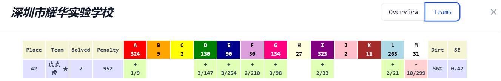

# $\text{Welcome to my blog!}$
  
## About Me
Here's **Anby**, fans of [Hiiragi Kagami](https://mzh.moegirl.org.cn/%E6%9F%8A%E9%95%9C).  
::github{repo="Peakyi/Peakyi.github.io"}   
Grade 8 now, graduated from [Yaohua Experimental School](https://www.szyh.org/) for junior high in 2025.  
**Active OIer**, retired MO participant, retired PhO participant.

- **Luogu** account: [Anby_](https://www.luogu.com.cn/user/728401)
- **Bilibili** account: [Anby_](https://space.bilibili.com/2004653059)
- **NECM** account: [autumnrains](https://music.163.com/#/user/home?id=33667727)  

## DHL integral
$$
\int_0^\infty\sin x^n\,dx=\frac1n\Gamma\left(\frac1n\right)\sin\left(\frac{\pi}{2n}\right)
$$
This integral was be found by DHL in a exam.

## Achieve
2024 CSP-Senior Second Prize  
2025 Chinese High School Mathematics League Third Prize
2025 National Olympics in Informatics Province (China) Second Prize
2026 XCPC ShenZhen Invitational Golden Prize, Rank 42

## My friends
- **Liuhy:** THE MOST GENIUS OIER IN THE WORLD!!! \bx\bx
- **DHL:** An active PhO participant, fill with planty of great idea.
- **Andy:** Really good man, the leader of [Andy AK ICPC](https://codeforces.com/group/a5HIB7RZpx/blog).
- **Danny:** Mathematics lover, my best friend in junior high.
- **Yao Ming:** Video editing enthusiast, I like his video in bilibili.
## More detail
Learning in Tung Wah Junior High for grade 8.  
Team member of [Andy AK ICPC](https://codeforces.com/group/a5HIB7RZpx/blog), ~~Andy's sweetheart~~.

## Match history
**2026 XCPC ShenZhen Invitational, Golden Prize**

